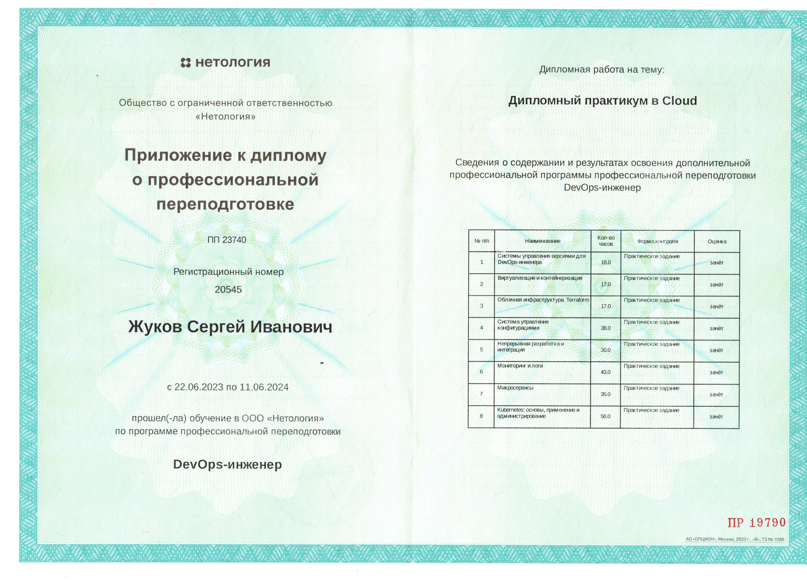
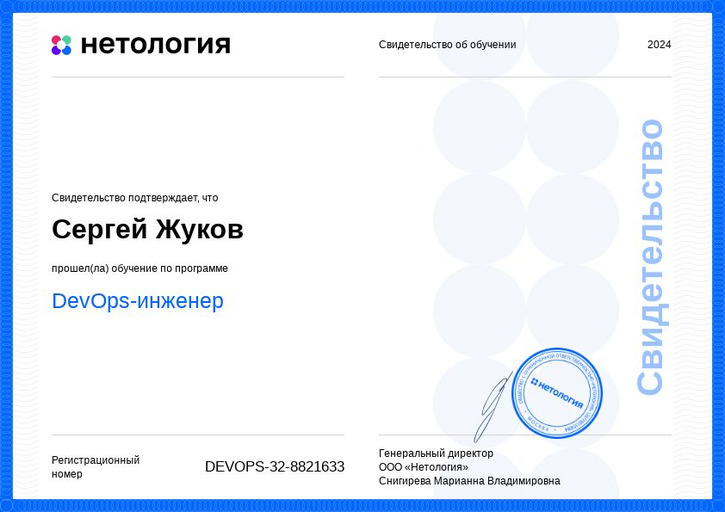
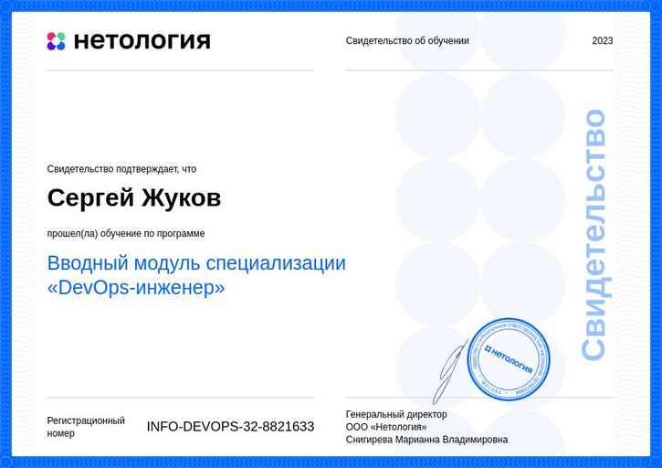
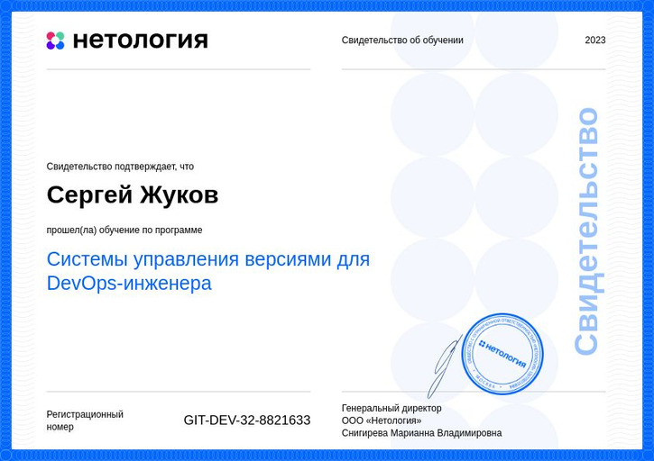
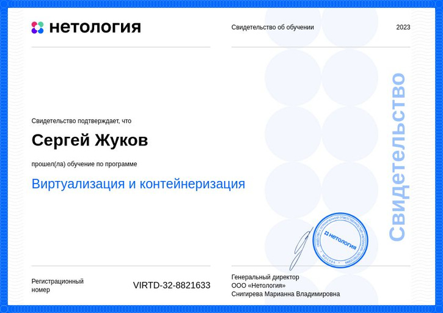
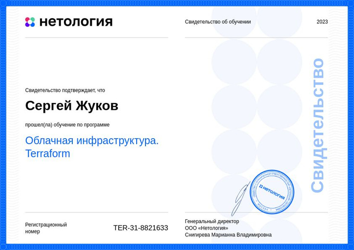
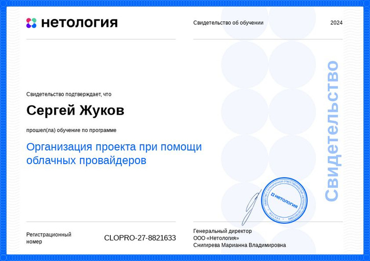
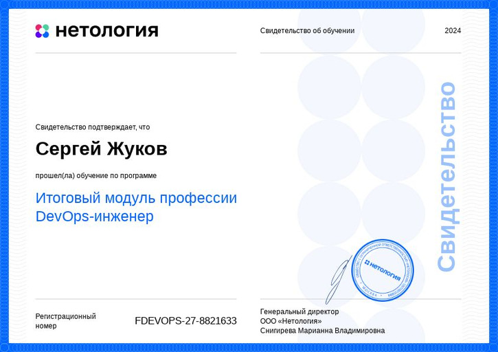

  

---

### Привет!   
### Я Сергей Жуков, DevOps-инженер

####  [Моё резюме](https://myresume.ru/resume/Rcs729UOejg/) 
---

#### Мои Контакты

#### ☎️&ensp;+7 (905) 614-50-00 &emsp; 📨📫&ensp;<a href="BeatlJS@mail.ru"> BeatlJS@mail.ru </a>

  
  
  

---

#### 🛠 Мой стек
<table>
  <tr>
    <td>
      

        &nbsp;
        &nbsp;
        &nbsp;
        &nbsp;
        &nbsp;
        
        &nbsp;
        
        &nbsp;
        &nbsp;
        &nbsp;
        &nbsp;
        &nbsp;
        &nbsp;
        &nbsp;
        &nbsp;
        &nbsp;
        &nbsp;
        &nbsp;
        &nbsp;
        &nbsp;
        &nbsp;
        &nbsp;
        &nbsp;
        &nbsp;
        &nbsp;
      

       
      Linux, Windows, Bash, Git, Ansible, GitHub, Terraform, Docker, Docker-compose, Kubernetes, HELM, GitLab,  
      CI/CD, Jenkins, Jira, MySQL, PostgreSQL, Prometheus, Grafana, ELK,  Alertmanager, HTML, CSS, JavaScript, jQuery
    </td>
  </tr>
</table>

---

#### Вот что я умею делать

- Развертывать в облаке кластеры Kubernetes c помощью Gitlab CI/CD, Terraform и Ansible: [Ссылка на дипломную работу](https://gitlab.com/beatljs/netology-diplom/-/blob/de6bbbe3dc2fce41f0b8be284cd8f5f2dbbcceaf/README.md)  
-   Работать с Jenkins: [Ссылка на решение домашнего задания по Jenkis](https://github.com/beatljs/mnt-homeworks/blob/09-ci-04-jenkins/README.md)
- Работать с кластерами Kubernetes: [Ссылка на репозитории с выполненными ДЗ по Kubernrtes](https://github.com/beatljs/homeworks/tree/main/K8s)
- Работать с Yandex Cloud: [Ссылка на репозитории с выполненными ДЗ по работе c YC](https://github.com/beatljs/homeworks/tree/main/clopro)
- Работать с CI/CD Gitlab: [Ссылка на решение с выполненными ДЗ по работе c GitLab](https://github.com/beatljs/mnt-homeworks/tree/09-ci-06-gitlab)
- 🤔 I’m looking for help with ...

---

#### Диплом и сертификаты Нетологии 

    
 📜 &ensp; Диплом о профессиональной переподготовке 

    
    

 

    
 📜 &ensp; Свидетельство об образовании 

    

    
 📜 &ensp; Вводный модуль специализации DevOps-инженер 

    

    
 📜 &ensp; Системы управления версиями для DevOps-инженера 

    

    
 📜 &ensp; Виртуализация и контейнеризация 

    

    
 📜 &ensp; Облачная инфраструктура. Terraform 

    

    
 📜 &ensp; Непрерывная разработка и интеграция 

    

    
 📜 &ensp; Kubernetes: основы, применение и администрирование 

    

    
 📜 &ensp; Организация проекта при помощи облачных провайдеров 

    

    
 📜 &ensp; Итоговый модуль профессии DevOps-инженер 

    

---

<!--
**beatljs/beatljs** is a ✨ _special_ ✨ repository because its `README.md` (this file) appears on your GitHub profile.

Here are some ideas to get you started:

- 🔭 I’m currently working on ...
- 🌱 I’m currently learning ...
- 👯 I’m looking to collaborate on ...
- 🤔 I’m looking for help with ...
- 💬 Ask me about ...
- 📫 How to reach me: ...
- 😄 Pronouns: ...
- ⚡ Fun fact: ...
-->
